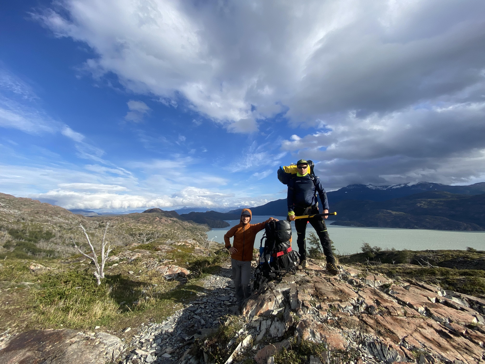
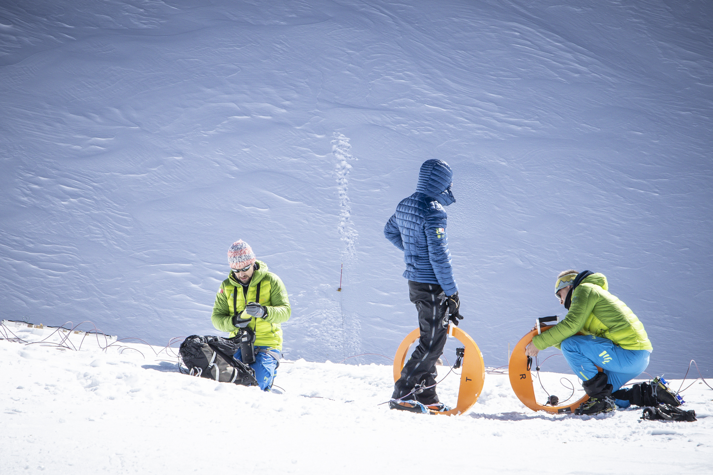
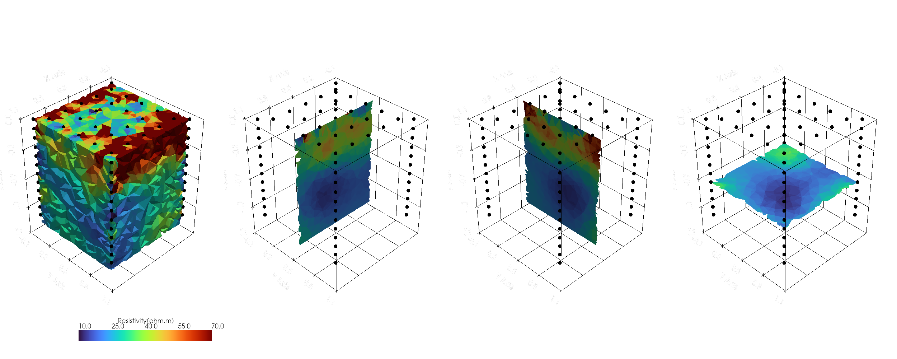
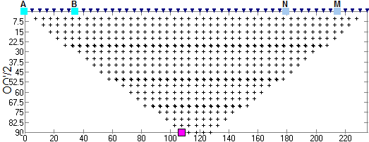

Title: Geophysics
Slug: geophysics
Date: 2025-01-28

My research in applied geophysics aims to use and integrate electromagnetic and seismic techniques, with state-of-the-art python modeling capabilities, to understand and monitor structures and processes in the natural environment.  

#### Patagonia expedition
_Tierra del Fuego & Torres del Paine (CL) 2024_
  
  
---

#### IceMemory Project
_Gran Sasso d'Italia (IT), 2022_
  
[Articolo UNIPD](https://www.geoscienze.unipd.it/la-missione-ice-memory-protagonista-di-una-puntata-di-tgr-leonardo)  
[Articolo GDB](https://www.giornaledibrescia.it/brescia-e-hinterland/il-geologo-bresciano-che-cerca-carote-di-ghiaccio-con-lunga-memoria-henliiuc)
---
#### Agripolis
_Legnaro(IT), 2021-2024_

---
This is how a dipole-dipole sequence works

---
#### Sadole Rock Glacier
_Ziano di Fiemme (IT), 2023_

---